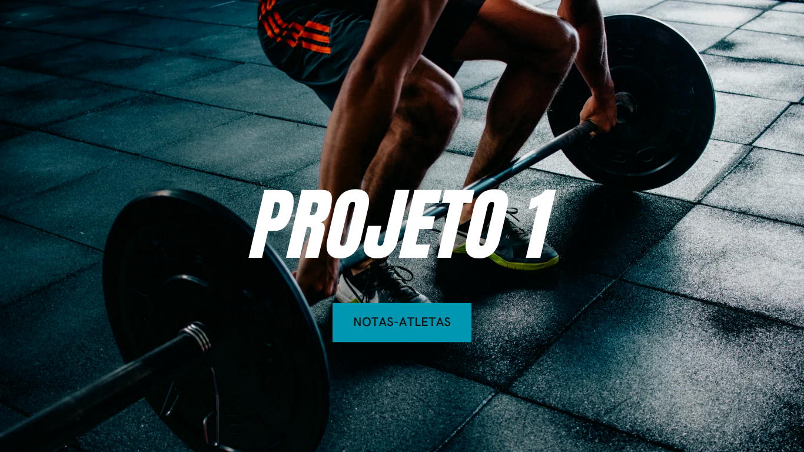

 🏆 Primeiro Projeto em JS (Notas Atletas)

## 💡 Sobre o Projeto

Este projeto demonstra a aplicação de Programação Orientada a Objetos (POO) em JavaScript, utilizando classes para modelar atletas e calcular a média de suas notas, desconsiderando a maior e a menor nota do conjunto.

## ✨ Funcionalidades

* **Modelagem de Classes:** Utilização de uma classe base (`Atletas`) e uma classe filha (`Nome`) para herança e especialização de responsabilidades.
* **Cálculo de Média:** Função especializada para calcular a média de 5 notas, **descartando automaticamente a nota mais alta e a mais baixa** (média de 3 notas válidas).
* **Modularização:** O código é dividido em módulos (`.js`) e importado no arquivo principal (`main.js`), facilitando a organização.
* **Saída Formatada:** Exibe no console o nome do atleta, as notas originais e a média calculada.

## 📁 Estrutura do Projeto

O projeto é composto por três arquivos principais:

| Arquivo | Descrição |
| :--- | :--- |
| `main.js` | **Ponto de Entrada.** Contém a matriz de dados dos atletas e a função que itera sobre ela, criando as instâncias da classe. |
| `atletas.js` | **Classe Base (`Atletas`).** Define as propriedades básicas (nome, notas) e o método `getIndor()` para informações básicas. |
| `nome.js` | **Classe Lógica (`Nome`).** Herda de `Atletas` e implementa a lógica do desafio: `calcularMediaNotas()` e `apresentarResultado()`. |

## 🚀 Como Executar o Projeto

Para rodar este projeto, você precisará ter o **Node.js** instalado em sua máquina.

### 1. Pré-requisito

- Certifique-se de ter o Node.js instalado.
